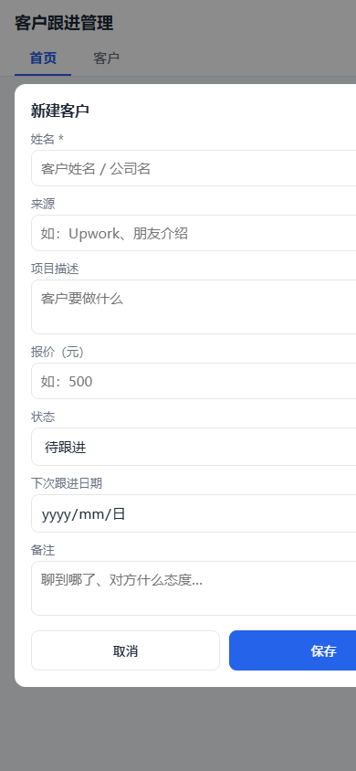
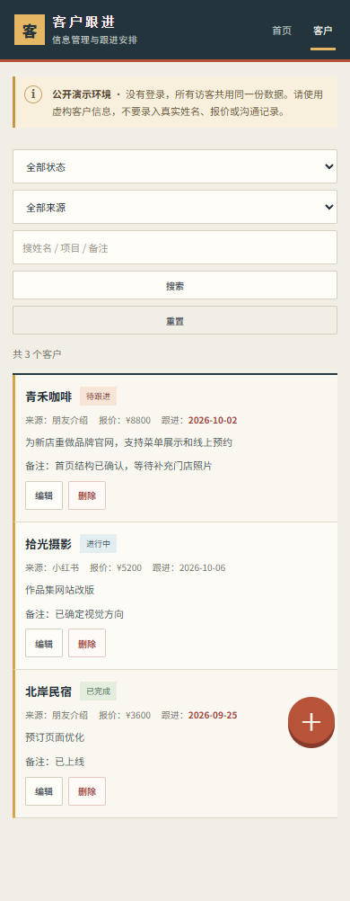
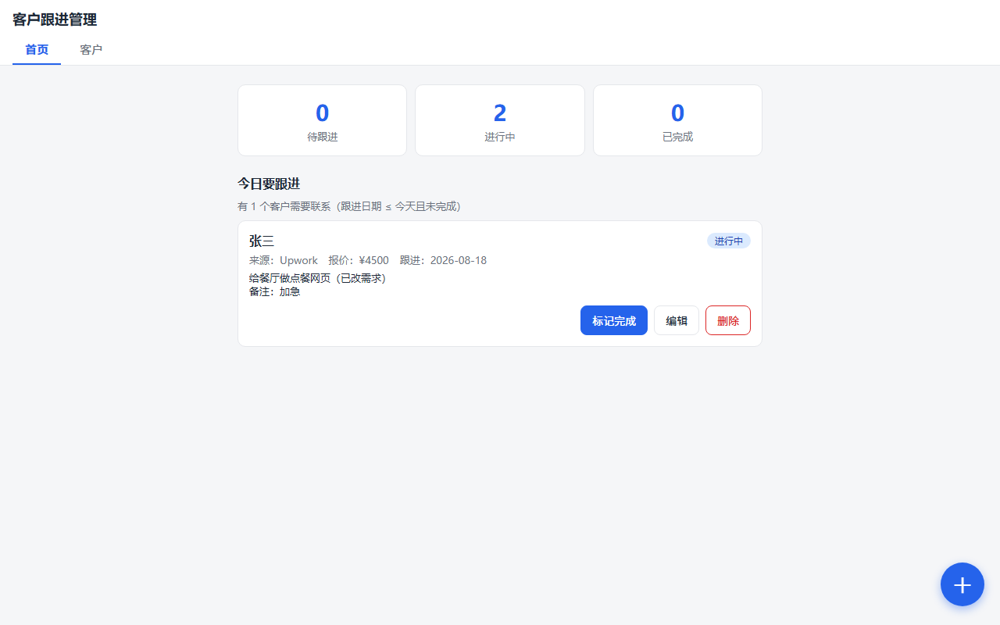

# 客户跟进管理（Client Tracker）—— 作品集演示版

> **本仓库是作品集演示版（Portfolio Demo）**：用于展示"前端 + 后端 + 数据库"的完整开发能力，**没有登录鉴权**。请只在里面放演示用的假数据，不要录入真实客户信息（含报价、谈判备注等敏感内容）。

自由职业者的客户台账：记住每个客户从哪来、谈到哪、报了多少价、下次什么时候联系——**不丢客户、不忘跟进**。手机和电脑都能用。

## 功能

- **客户增删改查**：姓名、来源、项目描述、报价、状态、备注、下次跟进日期
- **筛选搜索**：按状态 / 来源 / 关键词（搜姓名、项目、备注）组合筛选
- **首页仪表盘**：待跟进 / 进行中 / 已完成 各多少单，今日要跟进的客户一目了然
- **数据持久化**：SQLite 存库，刷新、重启、关机都不丢
- **移动端友好**：窄屏单列布局，手机上单手操作

## 截图

| 手机首页 | 手机客户列表 | 电脑首页 |
| --- | --- | --- |
|  |  |  |

## 技术栈

- **后端**：Python + FastAPI（提供 REST API + 托管前端页面）
- **数据库**：SQLite（Python 自带，零安装零配置）
- **前端**：原生 HTML + CSS + JavaScript（单页应用，无框架无构建步骤——项目体量小，原生三件套最轻，也符合学习目标）

## 怎么运行

需要 Python 3.10+。第一次使用：

```powershell
# 1. 在项目目录里创建虚拟环境（隔离依赖）
python -m venv .venv

# 2. 激活
.venv\Scripts\Activate.ps1

# 3. 安装依赖
pip install -r requirements.txt

# 4. 启动服务
python -m uvicorn main:app --port 8000
```

浏览器打开 **http://localhost:8000** 即可使用。启动时会自动创建数据库文件 `clients.db`（SQLite 表），无需任何初始化操作。

## 怎么验证

### 方式一：自动化接口自检（推荐先跑这个）

⚠️ 自检脚本会清空并写入测试数据，**必须指向独立的测试数据库运行**（绝不对着真实数据跑）：

```powershell
# 终端一：用临时测试库启动服务
$env:DATABASE_PATH = "test_clients.db"
python -m uvicorn main:app --port 8000

# 终端二：跑自检
.venv\Scripts\python verify_api.py
```

脚本会真实调用全部接口：增、查、筛选、改、统计、删、错误处理（含格式错误的中文提示），共 30 项检查，全过输出「全部通过 🎉」。测完删除 test_clients.db 即可。

### 方式二：浏览器手动操作清单

1. 打开 http://localhost:8000，首页应显示统计卡片和「今日要跟进」
2. 点右下角 **＋** 新建客户（姓名必填，试一个不填姓名的：应弹中文错误提示）
3. 新建一个「待跟进 + 下次跟进日期=今天」的客户 → 首页「今日要跟进」应出现它，点「标记完成」
4. 切到「客户」标签：筛选状态、来源、搜关键词，结果应实时对应
5. 编辑一个客户，改报价和备注，保存后列表应更新
6. 删除一个客户（有确认框）
7. **重启服务**（Ctrl+C 停掉再启动），数据应原封不动——这就是 SQLite 持久化

## API 一览

| 方法 | 路径 | 说明 |
| --- | --- | --- |
| GET | `/api/clients?status=&source=&q=` | 客户列表，三个筛选条件可组合，均可省略 |
| POST | `/api/clients` | 新建客户，返回 201 + 完整记录 |
| GET | `/api/clients/{id}` | 单个客户详情，不存在返回 404 |
| PUT | `/api/clients/{id}` | 修改客户（全字段覆盖） |
| DELETE | `/api/clients/{id}` | 删除客户 |
| GET | `/api/stats` | 首页统计：各状态数量 + 今日要跟进列表 |

错误约定：数据不合法返回 400（如「姓名不能为空」），id 不存在返回 404，错误原因都在响应体的 `detail` 字段里，前端直接展示。

## 项目结构

| 文件 | 职责 |
| --- | --- |
| `main.py` | 入口：FastAPI 应用、API 路由、静态文件托管、启动时建表 |
| `database.py` | 数据库层：SQLite 建表、增删改查、统计、数据校验 |
| `static/index.html` | 页面骨架（首页 + 列表 + 新建/编辑弹窗） |
| `static/style.css` | 移动优先样式 |
| `static/app.js` | 前端逻辑：调 API、渲染、筛选、表单交互 |
| `verify_api.py` | 接口自检脚本（30 项检查，可重复运行） |
| `railway.json` | Railway 部署配置（启动命令 + 健康检查） |
| `clients.db` | SQLite 数据文件（首次启动自动生成，已 gitignore） |

## 部署（Railway）

仓库已带 `railway.json`（启动命令 + 健康检查路径），部署只需三步：

1. 在 Railway 新建项目选本仓库（自动识别 Python + 启动命令）
2. **挂载持久化卷**（关键！Railway 的容器硬盘是临时的，重启即清空，不挂卷客户数据会丢）：
   - 项目 → Settings → Volumes → Add Volume，挂载路径填 `/data`
   - 添加环境变量 `DATABASE_PATH=/data/clients.db`
3. 部署完成后打开公开链接即可

⚠️ **安全提醒（重要）**：本仓库是作品集演示版，**没有登录功能**，公开链接任何人都能读写数据。线上只放演示假数据；如果要存真实客户信息，需要先加访问鉴权（当前版本未做，属已知限制）。
